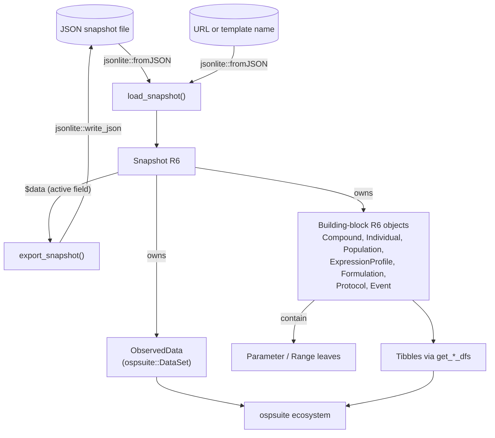
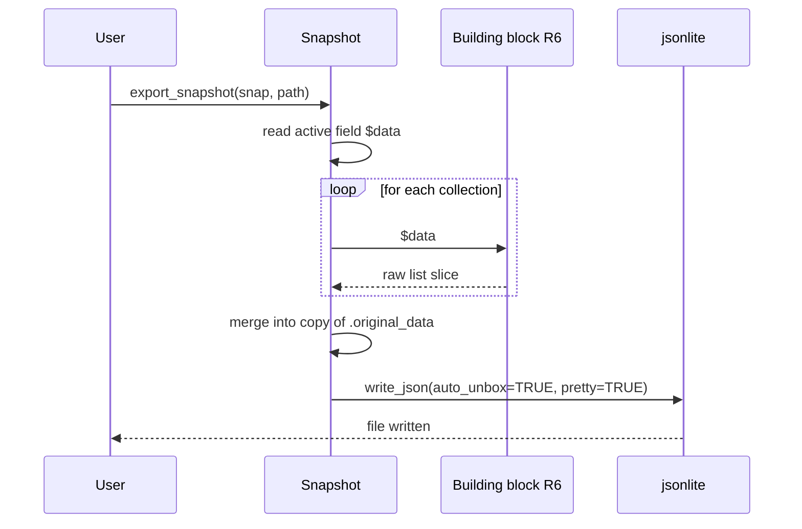

# osp.snapshots Architecture

## Overview

`osp.snapshots` is an R package that wraps PKSIM project snapshots (JSON files exported by Open Systems Pharmacology Suite) in a navigable R6 object tree. A user calls `load_snapshot()` to parse a JSON file (or a remote template), reads and mutates building blocks through R6 objects, optionally converts collections to tibbles for analysis, and calls `export_snapshot()` to write the modified snapshot back to JSON.

The design has two goals that shape every component. First, round-trip fidelity: any field not explicitly modelled is preserved verbatim through export, so unmapped snapshot sections (`Simulations`, `Classifications`, `ParameterIdentifications`, ...) survive a load/save cycle untouched. Second, a tidyverse-friendly view: every building-block collection has a `get_*_dfs()` function that produces a tibble suitable for `dplyr` pipelines and ospsuite workflows.

## Architecture diagram

## Domain model

A `Snapshot` is the root container. It holds eight kinds of building-block collections plus version, name, description, and any unmapped JSON. Each building-block class wraps a slice of the original JSON and exposes its fields through active bindings; leaf values are typically `Parameter` or `Range` objects.

| Class | File | Represents | Key relationships |
|-------|------|------------|-------------------|
| `Snapshot` | `R/Snapshot.R` | Root document (a PKSIM project export). | Owns all building-block collections; only class that touches `jsonlite` directly. |
| `Compound` | `R/Compound.R` | A drug molecule, including physicochemical properties, calculation methods, and processes (clearance, binding, transport, induction, inhibition). | Contains `Parameter` objects and a flat named list of `Process` objects via `$processes`; printed via several `compound_*` S3 print methods. |
| `Process` | `R/Process.R` | A single compound process (PK-Sim `CompoundProcess`): `internal_name`, `data_source`, optional `molecule`, `metabolite`, `species`, `parameters`, derived `category`. | Owned by `Compound`; one per entry of the raw `Processes` array. Contains `Parameter` objects keyed by name. |
| `Individual` | `R/Individual.R` | A simulated subject: demographic traits, origin data, expression-profile references, physiological parameters. | References `ExpressionProfile` by name; contains `LocalizedParameter`. |
| `Population` | `R/Population.R` | A population sampling specification: seed, settings, advanced parameters, individual-count range. | Contains `AdvancedParameter` (exported) and `Range`. |
| `ExpressionProfile` | `R/ExpressionProfile.R` | Enzyme/transporter expression: molecule, type, species, category, localization. | Loaded before `Individual` (spec ordering); contains `Parameter`. |
| `Formulation` | `R/Formulation.R` | Dissolution profile (Weibull, Lint80, Particles, Table, ZeroOrder, FirstOrder). | Contains `Parameter`. |
| `Protocol` | `R/Protocol.R` | Dosing protocol; either simple (interval + dose) or advanced (schemas of schema items). | Contains `Parameter`. |
| `Event` | `R/Event.R` | Administration event; references a formulation by key. | Contains `Parameter`. |
| `ObservedData` | `R/ObservedData.R` | Experimental dataset. NOT an R6 class in this package; converted to `ospsuite::DataSet` at load time via `loadDataSetFromSnapshot()`. | Bridge into the ospsuite ecosystem. |
| `Parameter` | `R/Parameter.R` | Scalar or table-based parameter: name, value, unit, value origin, optional table formula. Used in contexts where the parameter is identified by name within its owning building block (Compound, Formulation, Protocol, Event, schema parameters). | Leaf. |
| `LocalizedParameter` | `R/LocalizedParameter.R` | A `Parameter` identified by its full pipe-separated path within a target's parameter tree (Individual, ExpressionProfile, Simulation parameter trees). Inherits from `Parameter`; adds construction-time path validation and the v11+ `Applications` to `Events` path-segment migration. | Leaf; passes `inherits(x, "Parameter")`. |
| `Range` | `R/Range.R` | Min/max value with unit (age, weight, height, BMI). | Leaf utility class. |

Building blocks not yet wrapped in R6 (`Simulations`, `ObserverSets`, `ParameterIdentifications`, `SimulationComparisons`, `*Classifications`) live in `Snapshot`'s preserved raw data and pass through unchanged on export. See `snapshot-spec.md` for the full JSON contract.

## Entry points and user-facing API

All exports are listed in `NAMESPACE`. The user-facing surface clusters into four groups.

**Loading and exporting**

- `load_snapshot(source)` in `R/Snapshot.R` — dispatches on `source`: a local `.json` path, an `https?://` URL, or a template name resolved against the `OSPSuite.BuildingBlockTemplates` GitHub repo. Returns a `Snapshot`.
- `Snapshot$new(input)` — same effect when called directly with a path or a pre-parsed list.
- `export_snapshot(snapshot, path)` — thin wrapper around `snapshot$export(path)`.
- `osp_models(pattern = NULL)` — list available templates, fetched from `templates.json` on the same repo.

**Building-block factories**

- `create_individual(name, age, weight, gender, ...)` — `R/Individual.R`.
- `create_formulation(name, type, ...)` — `R/Formulation.R`.
- `create_parameter(name, value, path = NULL, unit, ...)` — `R/Parameter.R`. Returns a `LocalizedParameter` when `path` is supplied; otherwise a plain `Parameter`.
- `range(...)` — `R/Range.R`.

**Mutators (function + method pairs)**

Each mutator has both an exported function (taking a `Snapshot`) and a matching R6 method on `Snapshot`. The function variants validate the snapshot and delegate.

- `add_individual` / `remove_individual`
- `add_formulation` / `remove_formulation`
- `add_expression_profile` / `remove_expression_profile`
- `remove_population` (no `add_*` counterpart yet)

**Tibble exporters**

In `R/snapshot_dataframes.R`: `get_compounds_dfs`, `get_individuals_dfs`, `get_formulations_dfs`, `get_protocols_dfs`, `get_events_dfs`, `get_populations_dfs`, `get_expression_profiles_dfs`, `get_observed_data_dfs`. Each iterates the relevant collection and returns a tibble (or list of tibbles for compound sub-structures).

**Validators**

In `R/utils.R`: `validate_snapshot`, `validate_species`, `validate_gender`, `validate_unit`, `validate_population`. The enum validators check against ospsuite canonical sets (`ospsuite::Species`, `ospsuite::Gender`, `ospsuite::ospUnits`).

## Data flow

### Load

1. The user calls `load_snapshot(source)`.
2. The dispatcher in `R/Snapshot.R` recognises a local path, a URL, or a template name. URL and template branches fetch JSON via `jsonlite::fromJSON(..., simplifyDataFrame = FALSE, simplifyVector = FALSE)` and hand a list to `Snapshot$new()`. Local paths are passed straight through; `Snapshot$initialize` itself calls `jsonlite::fromJSON`.
3. `Snapshot$initialize` stores the parsed list as `private$.original_data` and iterates each known top-level key (`Compounds`, `ExpressionProfiles`, `Individuals`, `Formulations`, `Populations`, `Events`, `Protocols`, `ObservedData`). For each entry it constructs the corresponding R6 object (or `ospsuite::DataSet` for observed data via `loadDataSetFromSnapshot`) and stores the results in an unnamed private list (`private$.compounds`, etc.).
4. Building-block constructors keep their raw slice in `private$.data` and lazily initialise nested `Parameter` objects through `private$initialize_parameters()`. Unmapped sections in `.original_data` stay untouched.

### Mutate

Users read or write fields through active bindings (e.g. `individual$age <- 35`) or call methods (e.g. `snapshot$add_individual(ind)`). Mutations update each block's private `.data`; the surrounding `Snapshot` does not need to know that a leaf changed.

Named access to collections (e.g. `snapshot$compounds[["Midazolam"]]`) is built lazily from the unnamed internal lists, with numeric suffixes appended if two blocks share a name. This keeps identity (insertion order) separate from access (by name).

### Export

The `Snapshot$data` active field (defined in `R/Snapshot.R` around the `active = list(data = function() ...)` block) starts from a copy of `private$.original_data` and overwrites each known section with the current state of its R6 children. `ObservedData` is a special case: because `ospsuite::DataSet` does not round-trip back to the snapshot list shape, the original observed-data block is replayed verbatim (or cleared if the collection is empty). This is the mechanism that preserves unmapped fields.

## Tibble / dataframe layer

`R/snapshot_dataframes.R` is the bridge into the tidyverse. Each `get_*_dfs()` function walks the relevant collection, calls a per-block `to_df()` (or equivalent) method on each R6 object, and combines the results with `dplyr::bind_rows()`. Some collections (notably `Compound`) return a list of tibbles because the underlying block has several heterogeneous sub-structures (parameters, processes, calculation methods, etc.). `tibble::tibble` and `tibble::as_tibble` are the only constructors used.

This layer is read-only; mutating the returned tibbles does not feed back into the snapshot.

## OSPSuite integration

ospsuite is the canonical R interface to PK-Sim. `osp.snapshots` integrates with it in three ways:

- **Observed data**: `R/ObservedData.R` defines `loadDataSetFromSnapshot()`, called from `Snapshot$initialize` for each entry under `ObservedData`. It returns an `ospsuite::DataSet`, slotting observed data straight into the broader ospsuite analysis pipeline.
- **Validation**: `R/utils.R` validates species, gender, and units against ospsuite canonical enums.
- **Reexports**: `R/ospsuite-package.R` documents the package; `NAMESPACE` shows `importFrom(ospsuite, DataSet)`.

## Cross-cutting concerns

**Round-trip fidelity.** `Snapshot` always keeps the original parsed JSON in `private$.original_data`. The `data` active field rebuilds the export payload by merging current R6 state on top of that snapshot, so any top-level key the package does not model (`Simulations`, `ObserverSets`, `Classifications`, `ParameterIdentifications`, ...) passes through untouched.

**Unnamed-internal-list, named-access pattern.** Collections are stored as unnamed lists internally and exposed as named lists through active bindings. Duplicate names get numeric suffixes at access time. This separates positional identity (preserved for export) from convenient lookup by name.

**Lazy parameter parsing.** Building blocks defer `Parameter` construction until a parameter is actually requested, via each block's `private$initialize_parameters()`. Construction routes through the shared `build_parameters_from_raw()` helper in `R/parameter-init.R`; blocks whose parameters are localized (Individual today, Simulation once wrapped) pass `ctor = LocalizedParameter$new` to force path validation and the `Applications` to `Events` migration at construction. This keeps `Snapshot$new()` fast on large projects.

**Version mapping.** The numeric `Version` field (e.g. `80`) is mapped to a human PKSIM version (e.g. `"12.0"`) by `private$.get_pksim_version()` and exposed as the `pksim_version` active field, allowing future version-conditional behaviour.

**Loading order.** Per `snapshot-spec.md`, `ExpressionProfiles` are loaded first because `Individuals` reference them by name. The current `Snapshot$initialize` honours this by initialising `expression_profiles` before `individuals`.

**Path handling.** `private$.abs_path` stores either a normalised local path or a URL. The `path` active field returns a relative path (via `fs::path_rel`) when local, or the URL as-is.

**CLI output.** All informational messages and progress go through `cli` (`cli_alert_info`, `cli_alert_success`, `cli_abort`, `cli_h1`, `cli_li`). Print methods for collection objects live in `R/print_methods.R` and are registered as S3 methods.

**Dual API.** Mutators are exposed both as functions and as R6 methods. The function wrappers call `validate_snapshot()` first and then delegate. Both forms return the snapshot invisibly.

## File map

`R/`

| File | Contents |
|------|----------|
| `Snapshot.R` | `Snapshot` R6 class, `load_snapshot`, `export_snapshot`, snapshot mutators (`add_*` / `remove_*`), `osp_models`, template helpers. |
| `Compound.R` | `Compound` R6 class (compound metadata, properties, calculation methods, processes). |
| `Process.R` | `Process` R6 class (single compound process) and `create_process` factory. |
| `process_dataframes.R` | Tibble-layer helpers for compound processes: the long-form `processes` tibble emitter used by `get_compounds_dfs()` and the legacy per-category formatters used by the deprecated `Compound$<category>` accessors. |
| `Individual.R` | `Individual` R6 class and `create_individual` factory. |
| `Population.R` | `Population` R6 class and `AdvancedParameter` (exported). |
| `ExpressionProfile.R` | `ExpressionProfile` R6 class. |
| `Formulation.R` | `Formulation` R6 class and `create_formulation` factory. |
| `Protocol.R` | `Protocol` R6 class plus dosing-time helpers (`convert_ospsuite_time_to_duration`, `convert_ospsuite_time_unit_to_lubridate`). |
| `Event.R` | `Event` R6 class. |
| `ObservedData.R` | `loadDataSetFromSnapshot()` (snapshot → `ospsuite::DataSet`), `ObservedData` export object. |
| `Parameter.R` | `Parameter` R6 class and `create_parameter` factory (routes to `LocalizedParameter` when `path` is supplied). |
| `LocalizedParameter.R` | `LocalizedParameter` R6 class (subclass of `Parameter`); applies the v11+ `Applications` to `Events` path-segment migration. |
| `parameter-init.R` | Internal `build_parameters_from_raw()` helper shared across building blocks. |
| `Range.R` | `Range` R6 class and `range()` constructor. |
| `snapshot_dataframes.R` | All `get_*_dfs` exporters. |
| `print_methods.R` | S3 `print.*` methods for the collection and sub-structure classes listed in `NAMESPACE`. |
| `utils.R` | `validate_snapshot`, `validate_species`, `validate_gender`, `validate_unit`, `validate_population`. |
| `ospsuite-package.R` | Package documentation, imports. |

`inst/extdata/` — fixture snapshot(s) used by tests and examples.

`tests/testthat/` — one test file per building-block class plus integration tests; helpers in `helper-*.R`.

`vignettes/`

| File | Topic |
|------|-------|
| `osp-snapshots.Rmd` | Getting started: load, explore, modify, export. |
| `creating-building-blocks.Rmd` | Build individuals, formulations programmatically with factories. |
| `working-with-dataframes.Rmd` | Convert collections to tibbles for analysis. |
| `articles/` | Pkgdown-only articles (not bundled in the package). |

`snapshot-spec.md` — authoritative reference for the PKSIM JSON schema: every top-level section, field types, required flags, and domain-mapping notes describing what the PK-Sim CLI does with each property.

## Code references

| Component | File | Key symbols |
|-----------|------|-------------|
| Root R6 class and serialization | `R/Snapshot.R` | `Snapshot`, `Snapshot$initialize`, `Snapshot$export`, `Snapshot$data` (active), `Snapshot$pksim_version` (active), `private$.original_data` |
| Load dispatcher | `R/Snapshot.R` | `load_snapshot`, `.get_templates_data` |
| Templates and mutators | `R/Snapshot.R` | `osp_models`, `add_individual`, `remove_individual`, `add_formulation`, `remove_formulation`, `add_expression_profile`, `remove_expression_profile`, `remove_population`, `export_snapshot` |
| Compounds | `R/Compound.R` | `Compound` |
| Processes | `R/Process.R`, `R/create_process.R`, `R/process_dataframes.R` | `Process`, `create_process`, `process_category`, `compound_processes_to_long_df` |
| Individuals | `R/Individual.R` | `Individual`, `create_individual` |
| Populations | `R/Population.R` | `Population`, `AdvancedParameter` |
| Expression profiles | `R/ExpressionProfile.R` | `ExpressionProfile` |
| Formulations | `R/Formulation.R` | `Formulation`, `create_formulation` |
| Protocols | `R/Protocol.R` | `Protocol`, `convert_ospsuite_time_to_duration`, `convert_ospsuite_time_unit_to_lubridate` |
| Events | `R/Event.R` | `Event` |
| Observed data bridge | `R/ObservedData.R` | `loadDataSetFromSnapshot`, `ObservedData` |
| Leaf types | `R/Parameter.R`, `R/LocalizedParameter.R`, `R/Range.R` | `Parameter`, `LocalizedParameter`, `create_parameter`, `Range`, `range` |
| Shared parameter loader | `R/parameter-init.R` | `build_parameters_from_raw`, `ensure_path_from_name` |
| Tibble exporters | `R/snapshot_dataframes.R` | `get_compounds_dfs`, `get_individuals_dfs`, `get_formulations_dfs`, `get_protocols_dfs`, `get_events_dfs`, `get_populations_dfs`, `get_expression_profiles_dfs`, `get_observed_data_dfs` |
| Validation | `R/utils.R` | `validate_snapshot`, `validate_species`, `validate_gender`, `validate_unit`, `validate_population` |
| Print methods | `R/print_methods.R` | S3 methods for `*_collection` classes and compound sub-structures (see `NAMESPACE`) |
| JSON schema reference | `snapshot-spec.md` | Project, ExpressionProfile, Individual, Population, Compound, Formulation, Protocol, ObserverSet, Event, Simulation, DataRepository, ParameterIdentification, SimulationComparison, Classification |

## Glossary

| Term | Definition |
|------|------------|
| PKSIM (PK-Sim) | The Open Systems Pharmacology desktop application for physiologically based pharmacokinetic (PBPK) modelling. Produces JSON snapshots via its CLI. |
| Snapshot | A JSON export of a PKSIM project. Contains all building blocks, simulations, observed data, and metadata needed to reconstruct the project. |
| Building block | A reusable PKSIM domain object (Individual, Compound, Formulation, Protocol, Event, Population, ExpressionProfile, ObserverSet). Building blocks live at the project level and can be referenced by simulations. |
| Expression profile | Enzyme or transporter expression data for a species: which tissues express it, at what level, with what localization. |
| Individual | A virtual subject with demographic traits, physiological parameters, and references to expression profiles. |
| Compound | A small molecule or biologic drug: physicochemical properties, partition coefficients, clearance pathways, binding partners. |
| Formulation | A dissolution profile describing how a drug is released (Weibull, Lint80, particles, table, zero-order, first-order). |
| Protocol | A dosing schedule. Simple protocols specify dose plus interval; advanced protocols use schemas of schema items. |
| Event | An administration or perturbation that happens during a simulation. |
| Observed data | Experimental measurements (time, value, error). Mapped to `ospsuite::DataSet` rather than to a custom R6 class. |
| Parameter | A named value with unit and origin. May be scalar or table-based (formula). Identified by `Name` within its owning building block. |
| Localized parameter | A `Parameter` identified by its full pipe-separated path inside a target's parameter tree (typically a `Simulation` or `Individual`). The path locates where the override applies. Wrapped as R6 class `LocalizedParameter`, which inherits from `Parameter` and migrates v11+ `Applications` path segments to `Events` at construction. |
| Range | A min/max pair with unit, used for physiological bounds (age, weight, height, BMI). |
| ospsuite | The Open Systems Pharmacology R package: canonical R interface to PK-Sim. `osp.snapshots` integrates with it for observed data and for validating species, gender, and units. |
