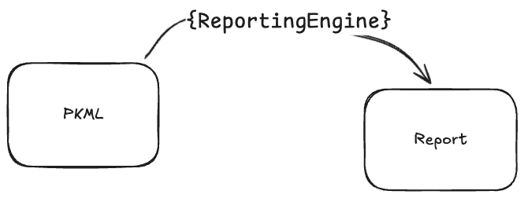
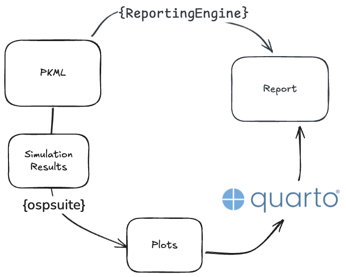
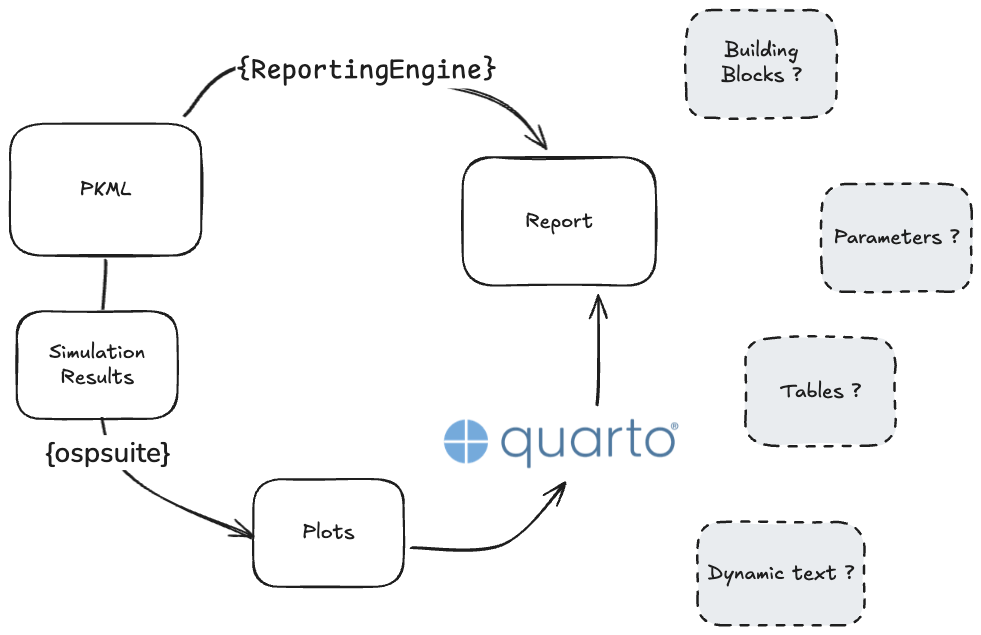
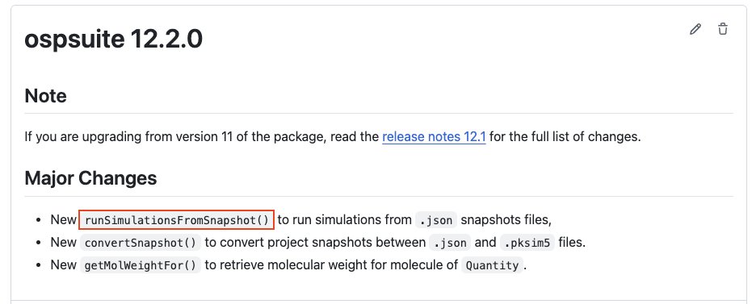

##  {footer="false" background-image="images/paste-5.png" background-size="contain" header="false"}



```{=html}
<style>
.reveal .reveal-header.hide-on-first {
  display: none !important;
}
</style>
```

<!-- ## {footer="false" background-image="images/paste-7.png" background-size="contain" header="false"} -->

# What is available today?

::: center
*Current reporting toolbox*
:::

## Reporting Engine: Streamlined report generation using predefined workflows.

{fig-align="center"}

## `{ospsuite}` can generate some standardized and reusable outputs.

{fig-align="center" height="400px"}

## `{ospsuite}` lacks ways to easily generate other outputs than plots.

{fig-align="center" height="400px"}

# PK-Sim Snapshots

::: center
*JSON representation of PK-Sim projects*
:::

## PK-Sim Snapshots are comprehensive.

``` json
{
  "Version": 80,
  "ExpressionProfiles": [...],
  "Individuals": [],
  "Populations": [...],
  "Compounds": [...],
  "Formulations": [...],
  "Protocols": [...],
  "ObserverSets": [...],
  "Events": [...],
  "Simulations": [...],
  "ParameterIdentifications": [...],
  "ObservedData": [...]
} 
```

## PK-Sim Snapshots are deeply nested data structure.

``` json
"Individuals": [
{
"Name": "European (P-gp modified, CYP3A4 36 h)",
"Seed": 17189110,
"OriginData": {
"CalculationMethods": [
"SurfaceAreaPlsInt_VAR1",
"Body surface area - Mosteller"
],
"Species": "Human",
"Population": "European_ICRP_2002",
"Gender": "MALE",
"Age": {
"Value": 30,
"Unit": "year(s)"
}
},
"Parameters": [
{
"Path": "Organism|Liver|EHC continuous fraction",
"Value": 1,
"ValueOrigin": {
"Source": "Unknown"
}
}
],
"ExpressionProfiles": [
"CYP3A4|Human|European (P-gp modified, CYP3A4 36 h)",
"AADAC|Human|European (P-gp modified, CYP3A4 36 h)",
"P-gp|Human|European (P-gp modified, CYP3A4 36 h)",
"OATP1B1|Human|European (P-gp modified, CYP3A4 36 h)",
"ATP1A2|Human|European (P-gp modified, CYP3A4 36 h)",
"UGT1A4|Human|European (P-gp modified, CYP3A4 36 h)",
"GABRG2|Human|European (P-gp modified, CYP3A4 36 h)"
]
},
{
"Name": "European (P-gp modified, CYP3A4 36 h, EHC off)",
"Seed": 17189110,
"OriginData": {
"CalculationMethods": [
"SurfaceAreaPlsInt_VAR1",
"Body surface area - Mosteller"
],
"Species": "Human",
"Population": "European_ICRP_2002",
"Gender": "MALE",
"Age": {
"Value": 30,
"Unit": "year(s)"
}
},
"ExpressionProfiles": [
"CYP3A4|Human|European (P-gp modified, CYP3A4 36 h)",
"AADAC|Human|European (P-gp modified, CYP3A4 36 h)",
"P-gp|Human|European (P-gp modified, CYP3A4 36 h)",
"OATP1B1|Human|European (P-gp modified, CYP3A4 36 h)",
"ATP1A2|Human|European (P-gp modified, CYP3A4 36 h)",
"UGT1A4|Human|European (P-gp modified, CYP3A4 36 h)",
"GABRG2|Human|European (P-gp modified, CYP3A4 36 h)"
]
}
]
```

## PK-Sim Snapshots are difficult to navigate.

```{r}
#| echo: false
snapshot <- jsonlite::fromJSON(
  "https://raw.githubusercontent.com/Open-Systems-Pharmacology/Rifampicin-Model/v2.0/Rifampicin-Model.json",
  simplifyVector = FALSE,
  simplifyDataFrame = FALSE
)
```

```{r}
snapshot$Compounds
```

------------------------------------------------------------------------

```{r}
snapshot$Compounds[[1]]$Lipophilicity[[1]]
```

## PK-Sim Snapshots are difficult to extract data from.

```{r}
# Extract Compound Processes
purrr::map(
  snapshot$Compounds,
  ~ purrr::map(
    .x$Processes,
    ~ paste0(.x$InternalName, ": ", .x$Molecule)
  ) |>
    purrr::list_c()
) |>
  purrr::list_c()

```

## The Problem {.center}

::: {.fragment .fade-in}
PK-Sim Snapshots are **comprehensive** but **complex**.
:::

::: {.fragment .fade-in}
Existing R tools work but require a lot of **time** and **expertise**.
:::

## The Solution {.center}

An **intuitive** and **powerful** interface **tailored** for snapshots.

# `{osp.snapshots}`

::: center
*An R package to work with PK-Sim Snapshots*
:::

```{r}
#| label: setup
#| include: false
devtools::load_all()
```

## `{osp.snapshots}` is an open source package that anyone can use and contribute to.

```{r}
#| eval: false
# Install from GitHub
pak::pak("esqLABS/osp.snapshots")

library(osp.snapshots)
```

## `{osp.snapshots}` Features

-   📂 **Load** snapshots

## `{osp.snapshots}` can load snapshots from different sources

-   From local files

```{r}
#| eval: false
snapshot <- load_snapshot("path/to/my/pksim_snapshot.json")
```

. . .

-   From an URL

```{r}
snapshot <- load_snapshot(
  "https://raw.githubusercontent.com/Open-Systems-Pharmacology/Efavirenz-Model/refs/heads/master/Efavirenz-Model.json"
)
```

. . .

-   From an existing OSP model (available on GitHub)

```{r}
snapshot <- load_snapshot("Rifampicin")
```

## `{osp.snapshots}` Features

-   📂 **Load** from different sources
-   🔍 **Explore** snapshots and its building blocks

## `{osp.snapshots}` provides an intuitive interface to navigate snapshots

`{osp.snapshots}` provides a print method for snapshot objects that summarizes the content of the snapshot.

```{r}
snapshot
```

------------------------------------------------------------------------

### List elements per building block type

```{r}
snapshot$compounds
snapshot$individuals
```

------------------------------------------------------------------------

### Explore a specific building block

```{r}
snapshot$compounds$Rifampicin
```

------------------------------------------------------------------------

```{r}
snapshot$individuals$`European (P-gp modified, CYP3A4 36 h)`
```

------------------------------------------------------------------------

### Access individual properties directly

```{r}
snapshot$individuals$`European (P-gp modified, CYP3A4 36 h)`$age
snapshot$individuals$`European (P-gp modified, CYP3A4 36 h)`$gender
snapshot$individuals$`European (P-gp modified, CYP3A4 36 h)`$weight
```

------------------------------------------------------------------------

## `{osp.snapshots}` Features

-   📂 **Load** from different sources
-   🔍 **Explore** snapshots and building blocks
-   ✏️ **Edit** snapshots programmatically

------------------------------------------------------------------------

## `{osp.snapshots}` provides easy ways to create and modify building blocks

```{r}
# Create a new individual
demo_patient <- create_individual(
  name = "Demo Patient",
  age = age(45),
  weight = weight(75),
  height = height(65),
  gender = "FEMALE"
)
# Add to snapshot
snapshot$add_individual(demo_patient)
# Remove a building block
snapshot$remove_individual("European (P-gp modified, CYP3A4 36 h, EHC off)")
snapshot$individuals
```

------------------------------------------------------------------------

**Before:**

```{r}
# Edit building block
snapshot$individuals$`Demo Patient`
```

**Modify:**

```{r}
snapshot$individuals$`Demo Patient`$height <- 165
```

------------------------------------------------------------------------

**After:**

```{r}
snapshot$individuals$`Demo Patient`
```

## `{osp.snapshots}` Features

-   📂 **Load** from different sources
-   🔍 **Explore** snapshots and building blocks
-   ✏️ **Edit** snapshots programmatically
-   📊 **Extract** deeply nested data into flat structures

## `{osp.snapshots}` extracts data and generates data frames

```{r}
#| eval: false
# Extract all individuals to structured data frames
get_compounds_dfs(snapshot)
```

```{r}
#| echo: false
head(dplyr::select(
  get_compounds_dfs(snapshot),
  compound,
  type,
  parameter,
  value,
  unit
))
```

------------------------------------------------------------------------

```{r}
# Some building blocks are extracted as list of data frames
get_individuals_dfs(snapshot)
```

## `{osp.snapshots}` Features

-   📂 **Load** from different sources
-   🔍 **Explore** snapshots and building blocks
-   ✏️ **Edit** snapshots programmatically
-   📊 **Extract** deeply nested data into flat structures
-   💾 **Export** snapshots

## `{osp.snapshots}` is fully interoperable with PK-Sim

```{r}
#| eval: false
# Export modified snapshot
export_snapshot(snapshot, "Rifampicin_modified.json")
```

## `{osp.snapshots}` Features

-   📂 **Load** from different sources
-   🔍 **Explore** snapshots and building blocks
-   ✏️ **Edit** snapshots programmatically
-   📊 **Extract** deeply nested data into flat structures
-   💾 **Export** snapshots

::: notes
All these features makes reporting easier and less error-prone: The abilitity to load, interactively explore and programatically edit and extract all pbpk project details to tidy formats is the perfect toolbox to streamline report generation.
:::

------------------------------------------------------------------------

{fig-align="center" height="400px"}

# What's next?

::: incremental
-   🧱 **More building blocks**
-   📈 **Plotting**
-   🔬 **Simulations Design**
:::

# Thank you!

::: header
:::

🔗 [github.com/esqLABS/osp.snapshots](https://github.com/esqLABS/osp.snapshots)

{fig-align="center" height="200px"}